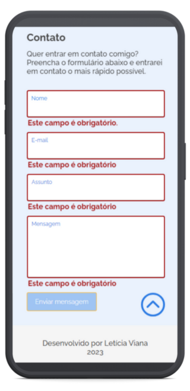

# **Portfólio de Letícia Viana**

### **Projeto de Challenge Portfólio Pessoal**

Desafio do Programa ONE - Oracle Next Education, em parceria com a Alura, no qual recebemos a missão de dar vida ao nosso portfólio pessoal seguindo, preferencialmente, o modelo disponibilizado pelo Figma, para, assim, já simularmos a rotina de um Desenvolvedor Web Front-End.

    

#

## **Índice:**

1. [Minhas implementações](#1-minhas-implementações)
2. [Tecnologias utilizadas](#2-linguagenstecnologias-utilizadas)
3. [Imagens do projeto](#3-imagens-do-projeto)
4. [Como usar](#4-como-usar)
5. [Autora e contato](#5-autora-e-contato)
6. [Status do Projeto](#6-status-do-projeto)

#

### **1. Minhas implementações**

- Design responsivo para desktop (1920 x 1080/1440 x 1024), tablet (768 x 1174) e celular (360 x 933);
- Validação do formulário de contato para que não seja possível enviar com campos não preenchidos ou preenchidos de maneira inválida e estilização que deixa o botão para enviar a mensagem "desabilitado" até que os campos sejam corrigidos.
- Integração com serviço de terceiros para que a mensagem enviada pelo formulário de contato chegue ao meu e-mail e eu possa respondê-la. Serviço utilizado: [formsubmit.co](https://formsubmit.co/).

#

### **2. Linguagens/tecnologias utilizadas**

 
    
    
    

 

#

### **3. Imagens do projeto**

     
     
     
    
    
    
    
    
    

#

### **4. Como usar**

Para acessar, clique <a href="https://lettyviana.github.io/challenge-portfolio-alura/" target="_blank">aqui</a>.

#

### **5. Autora e contato**

#

### **6. Status do projeto**

- [x] Funcional;
- [x] Responsivo (desktop (1920 x 1080/1440 x 1024), tablet (768 x 1174) e celular (360 x 933));
- [x] Concluído, sujeito a revisitações.